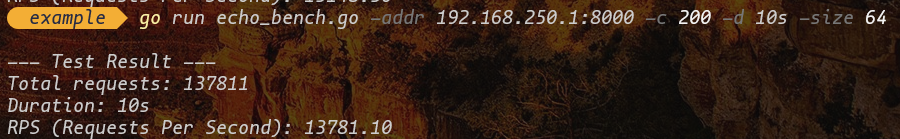
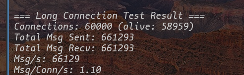
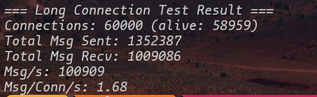
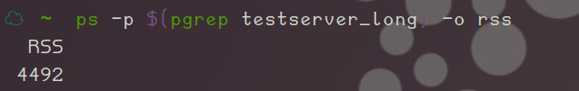
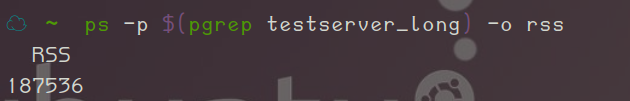

# 性能测试

## 测试环境

### 服务端

| 软硬件    | 配置                                         |
| --------- | -------------------------------------------- |
| CPU       | 14cores, x86_64,Intel(R) Core(TM) i5-14600KF |
| Memory    | 32GB                                         |
| NIC       | 1Gbps                                        |
| OS        | Ubuntu24.04                                  |
| Kernel    | Linux6.14.0-37-generic x86_64                |
| GCC工具链 | 13.3.0                                       |

### 客户端

| 软硬件 | 配置                                           |
| ------ | ---------------------------------------------- |
| CPU    | 11th Gen Intel(R) Core(TM) i5-1155G7 @ 2.50GHz |
| Memory | 8GB                                            |
| NIC    | 1Gbps                                          |
| OS     | Microsoft Windows 11 家庭中文版                |
| GO     | 1.25.5                                         |

两者间ping测得平均RTT为0.8ms

## 测试内容

### 1. 短连接测试

测试方式为:ping-pong

客户端代码

```go
// echo_bench.go
package main

import (
	"flag"
	"fmt"
	"log"
	"net"
	"sync"
	"sync/atomic"
	"time"
)

var (
	addr     = flag.String("addr", "127.0.0.1:8000", "server address")
	conns    = flag.Int("c", 100, "number of concurrent connections")
	duration = flag.Duration("d", 10*time.Second, "test duration")
	msgSize  = flag.Int("size", 64, "message size in bytes")
)

func main() {
	flag.Parse()

	var totalRequests uint64
	var wg sync.WaitGroup
	done := make(chan bool)

	// 启动统计 goroutine
	go func() {
		<-done
		rps := float64(atomic.LoadUint64(&totalRequests)) / duration.Seconds()
		fmt.Printf("\n--- Test Result ---\n")
		fmt.Printf("Total requests: %d\n", atomic.LoadUint64(&totalRequests))
		fmt.Printf("Duration: %v\n", *duration)
		fmt.Printf("RPS (Requests Per Second): %.2f\n", rps)
	}()

	// 启动并发客户端
	for i := 0; i < *conns; i++ {
		wg.Add(1)
		go func() {
			defer wg.Done()
			buf := make([]byte, *msgSize)
			for j := range buf {
				buf[j] = 'A' // 填充 'A'
			}

			endTime := time.Now().Add(*duration)
			for time.Now().Before(endTime) {
				// 新建连接（短连接）
				conn, err := net.Dial("tcp", *addr)
				if err != nil {
					log.Printf("Dial error: %v", err)
					time.Sleep(time.Millisecond) // 避免疯狂重试
					continue
				}

				// 发送消息
				_, err = conn.Write(buf)
				if err != nil {
					conn.Close()
					continue
				}

				// 读取响应（可选，验证正确性）
				resp := make([]byte, *msgSize)
				_, err = conn.Read(resp)
				if err != nil {
					conn.Close()
					continue
				}

				// 关闭连接（服务端已 shutdown，这里 close）
				conn.Close()

				atomic.AddUint64(&totalRequests, 1)
			}
		}()
	}

	// 等待测试时间结束
	time.Sleep(*duration)
	close(done)
	wg.Wait()
}

```

服务端代码

```cpp
#include <iostream>
#include <mymuduo/TcpServer.h>
#include <mymuduo/TcpConnection.h>
#include <mymuduo/Logger.h>
#include <mymuduo/Buffer.h>
#include <mymuduo/Timestamp.h>
#include <string>
#include <functional>

class EchoServer {
public:
    EchoServer(EventLoop* Loop,
            const InetAddress& addr,
            const std::string& name)
            : loop_(Loop),
            server_(loop_, addr, TcpServer::kNoReusePort, name) 
        {
            // 注册回调函数
            server_.setConnectionCallback(std::bind(&EchoServer::onConnection, this, std::placeholders::_1));
            server_.setMessageCallback(std::bind(&EchoServer::onMessage, this, std::placeholders::_1, std::placeholders::_2, std::placeholders::_3));
            // 设置合适loop线程数量
            server_.setThreadNum(1);
        }

        void start() {
            server_.start();
        }
private:
    // 连接建立和断开的回调
    void onConnection(const TcpConnectionPtr& conn) {
        if(conn->connected()) {
            LOG_INFO("conn UP : %s", conn->peerAddress().toIpPort().c_str());
        }else {
            LOG_INFO("conn DOWN : %s", conn->peerAddress().toIpPort().c_str());
        }
    }

    // 可读写事件的回调
    void onMessage(const TcpConnectionPtr &conn
                , Buffer* buf
                , Timestamp* time)
    {
        std::string msg = buf->retrieveAllAsString();
        std::cout << msg << std::endl;
        conn->send(msg);
        conn->shutdown(); // 写端关闭 EPOLLHUP=>closeCallback_
    }

    EventLoop* loop_;
    TcpServer server_;
};

int main() {
    EventLoop loop;
    InetAddress addr(8000, "0.0.0.0");
    EchoServer server(&loop, addr, "EchoServer-01");
    server.start();
    loop.loop(); // 启动mainLoop的底层poller
    return 0;
}

```



平均下来RPS为13k-14k

### 2. 长连接测试

服务端代码

```cpp
#include <iostream>
#include <mymuduo/TcpServer.h>
#include <mymuduo/TcpConnection.h>
#include <mymuduo/Logger.h>
#include <mymuduo/Buffer.h>
#include <mymuduo/Timestamp.h>
#include <string>
#include <functional>

class EchoServer {
public:
    EchoServer(EventLoop* Loop,
            const InetAddress& addr,
            const std::string& name)
            : loop_(Loop),
            server_(loop_, addr, TcpServer::kNoReusePort, name) 
        {
            // 注册回调函数
            server_.setConnectionCallback(std::bind(&EchoServer::onConnection, this, std::placeholders::_1));
            server_.setMessageCallback(std::bind(&EchoServer::onMessage, this, std::placeholders::_1, std::placeholders::_2, std::placeholders::_3));
            // 设置合适loop线程数量
            server_.setThreadNum(4);
        }

        void start() {
            server_.start();
        }
private:
    // 连接建立和断开的回调
    void onConnection(const TcpConnectionPtr& conn) {
        if(conn->connected()) {
            LOG_INFO("conn UP : %s", conn->peerAddress().toIpPort().c_str());
        }else {
            LOG_INFO("conn DOWN : %s", conn->peerAddress().toIpPort().c_str());
        }
    }

    // 可读写事件的回调
    void onMessage(const TcpConnectionPtr &conn
                , Buffer* buf
                , Timestamp* time)
    {
        std::string msg = buf->retrieveAllAsString();
        std::cout << msg << std::endl;
        conn->send(msg);
    }

    EventLoop* loop_;
    TcpServer server_;
};

int main() {
    EventLoop loop;
    InetAddress addr(8000, "0.0.0.0");
    EchoServer server(&loop, addr, "EchoServer-01");
    server.start();
    loop.loop(); // 启动mainLoop的底层poller
    return 0;
}

```

客户端

```go
package main

import (
	"flag"
	"fmt"
	"log"
	"net"
	"sync"
	"sync/atomic"
	"time"
)

var (
	addr      = flag.String("addr", "127.0.0.1:8000", "server address")
	conns     = flag.Int("conns", 10000, "number of concurrent connections")
	msgSize   = flag.Int("msg-size", 64, "message size in bytes")
	duration  = flag.Duration("duration", 60*time.Second, "test duration")
	msgPerSec = flag.Int("msg-per-sec", 10, "messages per second per connection")
)

func main() {
	flag.Parse()

	var totalSent uint64
	var totalRecv uint64
	var aliveConns int64

	// 创建连接
	var wg sync.WaitGroup
	for i := 0; i < *conns; i++ {
		wg.Add(1)
		go func() {
			defer wg.Done()
			conn, err := net.Dial("tcp", *addr)
			if err != nil {
				log.Printf("Dial failed: %v", err)
				return
			}
			defer conn.Close()

			atomic.AddInt64(&aliveConns, 1)
			defer atomic.AddInt64(&aliveConns, -1)

			msg := make([]byte, *msgSize)
			for i := range msg {
				msg[i] = 'x' // 填充任意数据
			}

			ticker := time.NewTicker(time.Duration(1e9 / *msgPerSec))
			defer ticker.Stop()

			done := make(chan bool, 1)
			go func() {
				buf := make([]byte, *msgSize*2) // 略大以防粘包
				for {
					n, err := conn.Read(buf)
					if err != nil {
						return
					}
					atomic.AddUint64(&totalRecv, 1)
					_ = n // 实际可校验内容
				}
			}()

			for {
				select {
				case <-ticker.C:
					_, err := conn.Write(msg)
					if err != nil {
						return
					}
					atomic.AddUint64(&totalSent, 1)
				case <-done:
					return
				}
			}
		}()
	}

	// 等待建立连接
	time.Sleep(2 * time.Second)
	fmt.Printf("Established %d connections\n", atomic.LoadInt64(&aliveConns))

	// 运行指定时长
	time.Sleep(*duration)

	// 输出结果
	sent := atomic.LoadUint64(&totalSent)
	recv := atomic.LoadUint64(&totalRecv)
	alive := atomic.LoadInt64(&aliveConns)

	msgsPerSec := float64(recv) / duration.Seconds()
	fmt.Printf("\n=== Long Connection Test Result ===\n")
	fmt.Printf("Connections: %d (alive: %d)\n", *conns, alive)
	fmt.Printf("Total Msg Sent: %d\n", sent)
	fmt.Printf("Total Msg Recv: %d\n", recv)
	fmt.Printf("Msg/s: %.0f\n", msgsPerSec)
	fmt.Printf("Msg/Conn/s: %.2f\n", msgsPerSec/float64(*conns))
}

```



测得单accepter + 多eventloop的情况下最大并发连接数量为59k



极限状态下，每秒最多处理10万个消息（64B小包 ）





在连接数为59k的情况下测得内存占用为30MB/10k conn


perf+火焰图分析


底部 `EventLoop::loop()` 占据大部分宽度 → 说明 CPU 主要花在事件循环上；

中间 `Channel::handleEvent` 和 `TcpConnection::handleRead` 有明显宽度 → 说明网络 I/O 是主要负载；
